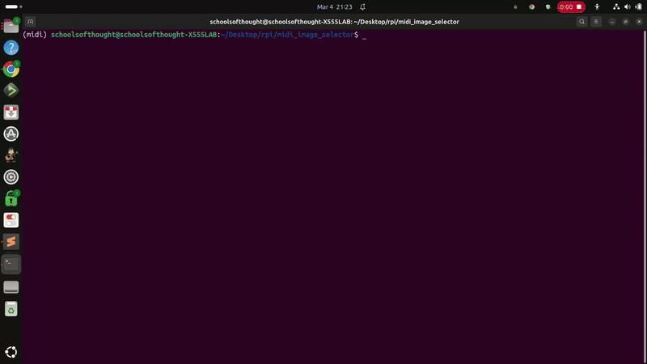

# MIDI Image Selector

The purpose of this program is to allow a performer to be able to display images via MIDI messages

## Core Functionality
The program must be able to do the following

### Load Images
Starting up program can read in image files provided a path as an argument. The program will recursively walk through 
subdirectories as well.

### Assign MIDI notes to Images
Program will quasi-randomly assign images to MIDI note values. The images are loaded in a list object and the index of 
each list item (ie image) can be called via MIDI note values. The program will sort list objects alphabetically by 
filename first.

#### All MIDI Notes Have Image
If MIDI note value is greater than total number of images, the image assignment will restart. If we have total of list of 3 images, MIDI note 0 thru 2 will have images by default. Using `midi_to_note()`, MIDI note 3 will start over at first image of list.

## Future Work

### Assign MIDI notes to pixels/regions of image
Having a different image displayed per MIDI note may be too chaotic for audience depending on the tempo of MIDI note 
changes. Another idea is to stay focused on a single image, but have each note reveal a section of the image on demand. 
Or have it additive, so regions of image are gradually revealed as notes are played until image is fully loaded.   

### Optimize Speed
Reactivity is slow. Definitely some latency between MIDI note press and image update. Might have to try using a different library?